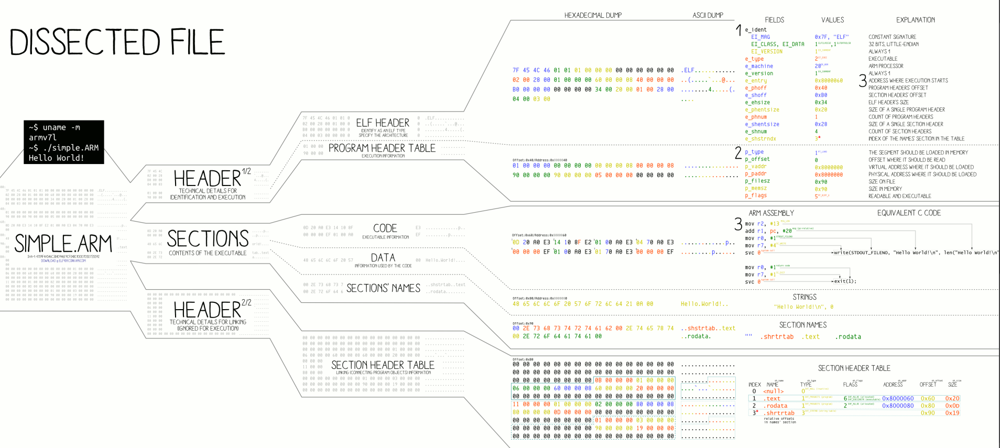

# ELF format and its key things

All binary exploitation in the repository is shown for ELF executable format files.
So, you need to understand what ELF format is.

## ELF format

ELF is a format commonly used by Unix systems.



This is an image from Wikipedia, but it shows a great picture of ELF.
So, the image shows that you have a simple.arm file. It has three main sections. The next picture also shows it.


### ELF Header

The ELF header is 32 bytes long. It identifies the format of the file. It starts with a sequence of four unique values: 0x7f, 0x45, 0x4c, 0x46. Which is just an ELF word.  The header also indicates whether the file is a 32-bit format or 64-bit, little-endian or big-endian, ELF version, OS version for which executable was compiled.

`readelf -h /bin/bash` will show you the ELF header.

Example:

```
ELF Header:
  Magic:   7f 45 4c 46 02 01 01 00 00 00 00 00 00 00 00 00
  Class:                             ELF64
  Data:                              2's complement, little endian
  Version:                           1 (current)
  OS/ABI:                            UNIX - System V
  ABI Version:                       0
  Type:                              DYN (Shared object file)
  Machine:                           Advanced Micro Devices X86-64
  Version:                           0x1
  Entry point address:               0x2f630
  Start of program headers:          64 (bytes into file)
  Start of section headers:          1166920 (bytes into file)
  Flags:                             0x0
  Size of this header:               64 (bytes)
  Size of program headers:           56 (bytes)
  Number of program headers:         11
  Size of section headers:           64 (bytes)
  Number of section headers:         29
  Section header string table index: 28
```

### The Program Header

This section shows you the segments at run-time. Also, it tells the system how to create a process image.

`readelf -l /bin/bash`

Example:

```
The elf file type is DYN (Shared object file)
Entry point 0x2f630
There are 11 program headers, starting at offset 64

Program Headers:
  Type           Offset             VirtAddr           PhysAddr
                 FileSiz            MemSiz              Flags  Align
  PHDR           0x0000000000000040 0x0000000000000040 0x0000000000000040
                 0x0000000000000268 0x0000000000000268  R      0x8
  INTERP         0x00000000000002a8 0x00000000000002a8 0x00000000000002a8
                 0x000000000000001c 0x000000000000001c  R      0x1
      [Requesting program interpreter: /lib64/ld-linux-x86-64.so.2]
  LOAD           0x0000000000000000 0x0000000000000000 0x0000000000000000
                 0x000000000002cd98 0x000000000002cd98  R      0x1000
  LOAD           0x000000000002d000 0x000000000002d000 0x000000000002d000
                 0x00000000000ad78d 0x00000000000ad78d  R E    0x1000
  LOAD           0x00000000000db000 0x00000000000db000 0x00000000000db000
                 0x0000000000035730 0x0000000000035730  R      0x1000
  LOAD           0x00000000001113f0 0x00000000001123f0 0x00000000001123f0
                 0x000000000000b914 0x00000000000155a8  RW     0x1000
  DYNAMIC        0x0000000000113cf0 0x0000000000114cf0 0x0000000000114cf0
                 0x0000000000000200 0x0000000000000200  RW     0x8
  NOTE           0x00000000000002c4 0x00000000000002c4 0x00000000000002c4
                 0x0000000000000044 0x0000000000000044  R      0x4
  GNU_EH_FRAME   0x00000000000f4930 0x00000000000f4930 0x00000000000f4930
                 0x00000000000044c4 0x00000000000044c4  R      0x4
  GNU_STACK      0x0000000000000000 0x0000000000000000 0x0000000000000000
                 0x0000000000000000 0x0000000000000000  RW     0x10
  GNU_RELRO      0x00000000001113f0 0x00000000001123f0 0x00000000001123f0
                 0x0000000000002c10 0x0000000000002c10  R      0x1

 Section to Segment mapping:
  Segment Sections...
   00     
   01     .interp
   02     .interp .note.ABI-tag .note.gnu.build-id .gnu.hash .dynsym .dynstr .gnu.version .gnu.version_r .rela.dyn .rela.plt
   03     .init .plt .plt.got .text .fini
   04     .rodata .eh_frame_hdr .eh_frame
   05     .init_array .fini_array .data.rel.ro .dynamic .got .got.plt .data .bss
   06     .dynamic
   07     .note.ABI-tag .note.gnu.build-id
   08     .eh_frame_hdr
   09     
   10     .init_array .fini_array .data.rel.ro .dynamic .got
```

### The Section Header

The Section Header lists the sections of the binary. Here, you can also meet a `.bss`, `.data`, `.text` sections from the memory layout page.

`readelf -S /bin/bash`

Example:

```
There are 29 section headers, starting at offset 0x11ce48:

Section Headers:
  [Nr] Name              Type             Address           Offset
       Size              EntSize          Flags  Link  Info  Align
  [ 0]                   NULL             0000000000000000  00000000
       0000000000000000  0000000000000000           0     0     0
  [ 1] .interp           PROGBITS         00000000000002a8  000002a8
       000000000000001c  0000000000000000   A       0     0     1
  [ 2] .note.ABI-tag     NOTE             00000000000002c4  000002c4
       0000000000000020  0000000000000000   A       0     0     4
  [ 3] .note.gnu.build-i NOTE             00000000000002e4  000002e4
       0000000000000024  0000000000000000   A       0     0     4
  [ 4] .gnu.hash         GNU_HASH         0000000000000308  00000308
       0000000000004aa8  0000000000000000   A       5     0     8
  [ 5] .dynsym           DYNSYM           0000000000004db0  00004db0
       000000000000e400  0000000000000018   A       6     1     8
  [ 6] .dynstr           STRTAB           00000000000131b0  000131b0
       0000000000009728  0000000000000000   A       0     0     1
  [ 7] .gnu.version      VERSYM           000000000001c8d8  0001c8d8
       0000000000001300  0000000000000002   A       5     0     2
  [ 8] .gnu.version_r    VERNEED          000000000001dbd8  0001dbd8
       00000000000000d0  0000000000000000   A       6     3     8
  [ 9] .rela.dyn         RELA             000000000001dca8  0001dca8
       000000000000dc80  0000000000000018   A       5     0     8
  [10] .rela.plt         RELA             000000000002b928  0002b928
       0000000000001470  0000000000000018  AI       5    24     8
  [11] .init             PROGBITS         000000000002d000  0002d000
       0000000000000017  0000000000000000  AX       0     0     4
  [12] .plt              PROGBITS         000000000002d020  0002d020
       0000000000000db0  0000000000000010  AX       0     0     16
  [13] .plt.got          PROGBITS         000000000002ddd0  0002ddd0
       0000000000000018  0000000000000008  AX       0     0     8
  [14] .text             PROGBITS         000000000002ddf0  0002ddf0
       00000000000ac991  0000000000000000  AX       0     0     16
  [15] .fini             PROGBITS         00000000000da784  000da784
       0000000000000009  0000000000000000  AX       0     0     4
  [16] .rodata           PROGBITS         00000000000db000  000db000
       0000000000019930  0000000000000000   A       0     0     32
  [17] .eh_frame_hdr     PROGBITS         00000000000f4930  000f4930
       00000000000044c4  0000000000000000   A       0     0     4
  [18] .eh_frame         PROGBITS         00000000000f8df8  000f8df8
       0000000000017938  0000000000000000   A       0     0     8
  [19] .init_array       INIT_ARRAY       00000000001123f0  001113f0
       0000000000000008  0000000000000008  WA       0     0     8
  [20] .fini_array       FINI_ARRAY       00000000001123f8  001113f8
       0000000000000008  0000000000000008  WA       0     0     8
  [21] .data.rel.ro      PROGBITS         0000000000112400  00111400
       00000000000028f0  0000000000000000  WA       0     0     32
  [22] .dynamic          DYNAMIC          0000000000114cf0  00113cf0
       0000000000000200  0000000000000010  WA       6     0     8
  [23] .got              PROGBITS         0000000000114ef0  00113ef0
       0000000000000100  0000000000000008  WA       0     0     8
  [24] .got.plt          PROGBITS         0000000000115000  00114000
       00000000000006e8  0000000000000008  WA       0     0     8
  [25] .data             PROGBITS         0000000000115700  00114700
       0000000000008604  0000000000000000  WA       0     0     32
  [26] .bss              NOBITS           000000000011dd20  0011cd04
       0000000000009c78  0000000000000000  WA       0     0     32
  [27] .gnu_debuglink    PROGBITS         0000000000000000  0011cd04
       0000000000000034  0000000000000000           0     0     4
  [28] .shstrtab         STRTAB           0000000000000000  0011cd38
       000000000000010a  0000000000000000           0     0     1
Key to Flags:
  W (write), A (alloc), X (execute), M (merge), S (strings), I (info),
  L (link order), O (extra OS processing required), G (group), T (TLS),
  C (compressed), x (unknown), o (OS specific), E (exclude),
  l (large), p (processor specific)
```

## ELF features

This is where you will understand the key things you need to do binary exploitation.

### Base Address

For accuracy, I took it from [here](https://refspecs.linuxbase.org/elf/elf.pdf "https://refspecs.linuxbase.org/elf/elf.pdf").

The virtual addresses in the program headers might not represent the actual virtual addresses of the program's memory image. The system chooses virtual addresses for individual processes, it maintains the segments’ relative positions. Because position-independent code uses relative addressing between segments, the difference between virtual addresses in memory must match the difference between virtual addresses in the file.

Thus, the base address for a process is a single constant value that represents the difference between the virtual addresses in memory and the virtual addresses in the file.

### Global Offset Table

Position-independent code cannot contain absolute virtual addresses. Global Offset Table holds the absolute addresses. The program uses a position independent address to access the GOT (Global Offset Table). The GOT then gives the program an absolute address.

Consider we have the following program:

```C
#include <stdio.h>

int main(int argc, char *argv[]){
  printf("Hello, World!");
}
```

In bash, compile it and run gdb. (I use [gef](https://gef.readthedocs.io/en/master/ "https://gef.readthedocs.io/en/master/")).

```bash
gcc hello.c -o hello
gdb -q hello
b *main + 38
r
got
```
Result:

```bash
gef➤  got

GOT protection: Partial RelRO | GOT functions: 2

[0x5655900c] printf@GLIBC_2.0  →  0x56556036
[0x56559010] __libc_start_main@GLIBC_2.0  →  0xf7df1a50
gef➤  
```

Here, you can see that the printf address is mapped to the actual printf address in libc.

### Segments permissions

Each segment has permission: read, write, execute, as always.

For example, do this in gef:

```bash
gef➤  vmmap
[ Legend:  Code | Heap | Stack ]
Start      End        Offset     Perm Path
0x56555000 0x56556000 0x00000000 r-- /home/zero/hello
0x56556000 0x56557000 0x00001000 r-x /home/zero/hello
0x56557000 0x56558000 0x00002000 r-- /home/zero/hello
0x56558000 0x56559000 0x00002000 r-- /home/zero/hello
0x56559000 0x5655a000 0x00003000 rw- /home/zero/hello
0xf7dd7000 0xf7df0000 0x00000000 r-- /usr/lib32/libc-2.28.so
0xf7df0000 0xf7f3e000 0x00019000 r-x /usr/lib32/libc-2.28.so
0xf7f3e000 0xf7fae000 0x00167000 r-- /usr/lib32/libc-2.28.so
0xf7fae000 0xf7faf000 0x001d7000 --- /usr/lib32/libc-2.28.so
0xf7faf000 0xf7fb1000 0x001d7000 r-- /usr/lib32/libc-2.28.so
0xf7fb1000 0xf7fb2000 0x001d9000 rw- /usr/lib32/libc-2.28.so
0xf7fb2000 0xf7fb5000 0x00000000 rw-
0xf7fcd000 0xf7fcf000 0x00000000 rw-
0xf7fcf000 0xf7fd2000 0x00000000 r-- [vvar]
0xf7fd2000 0xf7fd4000 0x00000000 r-x [vdso]
0xf7fd4000 0xf7fd5000 0x00000000 r-- /usr/lib32/ld-2.28.so
0xf7fd5000 0xf7ff1000 0x00001000 r-x /usr/lib32/ld-2.28.so
0xf7ff1000 0xf7ffb000 0x0001d000 r-- /usr/lib32/ld-2.28.so
0xf7ffc000 0xf7ffd000 0x00027000 r-- /usr/lib32/ld-2.28.so
0xf7ffd000 0xf7ffe000 0x00028000 rw- /usr/lib32/ld-2.28.so
0xfffdd000 0xffffe000 0x00000000 rw- [stack]
```

You see that stack, for instance, has read-write permissions.
