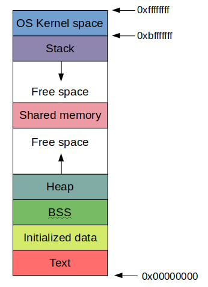

# Memory layout of the process

This is the memory view of the process.

## General view

### Stack

The stack stores the variables that were created during the execution of a function.

### Shared memory

The process loads the shared libraries used by executable in the shared memory.

### Heap

The heap stores the variables that were dynamically allocated with *alloc family of functions. For object oriented programming languages the heap also stores the objects.

### Data
